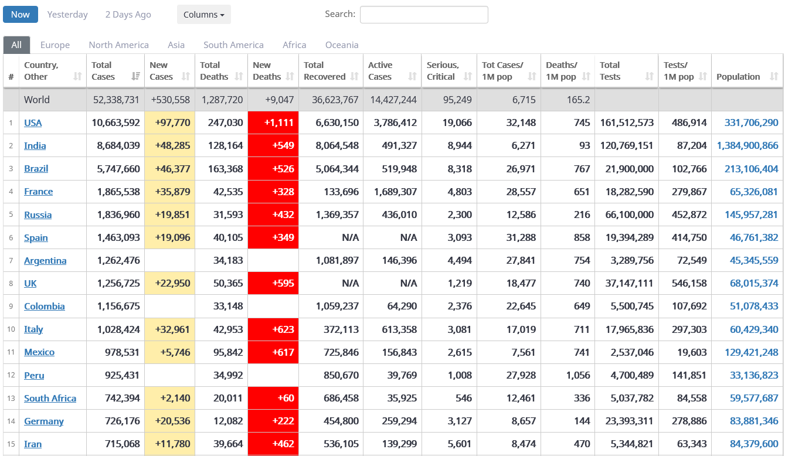

# Web Scraping using Beautiful Soup

## Summary

I am using Beautiful Soup for the this Python app. Beautiful Soup is a Python library for parsing data out of HTML and XML files (aka webpages). It works with your favorite parser to provide idiomatic ways of navigating, searching, and modifying the parse tree.

The major concept with Beautiful Soup is that it allows you to access elements of your page by following the CSS structures, such as grabbing all links, all headers, specific classes, or more. It is a powerful library. Once we grab elements, Python makes it easy to write the elements or relevant components of the elements into other files, such as a CSV, that can be stored in a database or opened in other software.

The data I used came from Coronavirus Update from COVID-19 Virus Pandemic - Worldometer. Reference:https://www.worldometers.info/coronavirus/


## Main goal

+ To access all of the content from the source code of the webpage with Python
+ Parse and extract data. 
+ Save the info in CSV file for further analysis.

## Methodology

1. Import Modules
2. Get the URL link
3. Navigate the URL Data Structure
4. Testing out data requests
5. Write data to a file in pseudo-code:
    + Open up a file to write in and append data. 
    + Write headers
    + Clear HTML tag and assign to text textall
    + Cleans irrelevant data from the text and assigns it to an array
    + Iterate over the results array to obtain the data and Write to file items No, Country, Total Case, New Case, Total Deaths, New Deaths, Total Recovered, Active Case, Serious, Critical, Tot Cases/1M pop, Deaths/1M pop, Total Tests, Tests/1M pop, Population and Continent
    + When complete, close the file
6. The output file in CSV format.

## Data info extracted:
No, Country, Total Case, New Case, Total Deaths, New Deaths, Total Recovered, Active Case, Serious, Critical, Tot Cases/1M pop, Deaths/1M pop, Total Tests, Tests/1M pop, Population and Continent of the Coronavirus Update from COVID-19 Virus Pandemic - Worldometer, Now



If you don't have Beautiful Soup, install with 'conda install beautifulsoup' in terminal.

Python requires us to explicitly load the libraries that we want to use:


```python
# If you don't have Beautiful Soup, install with 'conda install beautifulsoup' in terminal
# Python requires us to explicitly load the libraries that we want to use:
import requests
import bs4
import re
```

Load a webpage into python so that we can parse it and manipulate it.


```python
# Load a webpage into python so that we can parse it and manipulate it.
URL = 'https://www.worldometers.info/coronavirus/'
```

Control of Connection. We just turned the website code into a Python object. 


```python
# Control of Connection
# We just turned the website code into a Python object. 
response = requests.get(URL)
soup = bs4.BeautifulSoup(response.text, "html.parser")
```

Find all the tags with class main_table_countries_today


```python
# find all the tags with class total Country data
data = soup.findAll(attrs={'id':['main_table_countries_today']})
```

Open new file, make sure path to your data file is correct.

Later, I write headers


```python
f = open('worldometers_covid19_country.csv','w') # open new file, make sure path to your data file is correctf = open('worldometers_covid19_country.csv','w') # open new file, make sure path to your data file is correct
f.write("No\tCountry\tTotal Case\tNew Case\tTotal Deaths\tNew Deaths\tTotal Recovered\tActive Case\tSerious, Critical\tTot Cases/1M pop\tDeaths/1M pop\tTotal Tests\tTests/1M pop\tPopulation\tContinent" + "\n") # write headers
```


    178


```python
# Clear HTML tag and assign to text textall
results = []                               # Initialize array results
textall  = '' 
for element in data:                       # Iterate over the data array
     TAG_RE = re.compile(r'<[^>]+>')       # Prepare pattern to clean html tag from str (element) strings
     text = TAG_RE.sub('', str(element))   # Apply pattern and clean text html tag
     textall  = textall + text             # Add each line in the textall string
text = textall                             # Assign to text textall
```


```python
# Cleans irrelevant data from the text and assigns it to an array
text = text.split("\n", 216)[216];                      # Delete the first 216 lines of the text
text = text.replace("\n\n\nTotal:", "Total:")           # Remove space after string 

largo = len(text)                                       # Determine length of text                                    
Total = int(text.find('Total:'))                        # Determines the position of the string Total:    
text = text[:Total] + text[(Total+largo):]              # Removes all characters from the text starting from the string Total: to the end

results = []
results = text.split("\n")                               # Create result arrays with valid data

results.pop()                                            # To remove the last item from the list  
```


    ''


```python
results_end = []
i = 0
for element in results:  # Iterate over the results array
    i = i + 1
    if i >= 1 and i <= 16:
        if i != 8: 
            item = str(element)
            item = item.strip()
            if item == '': item = '--'  
            results_end.append(item)
    elif i == 19:
        i = 0  
```

Get the data No, Country, Total Case, New Case, Total Deaths, New Deaths, Total Recovered, Active Case, Serious, Critical, Tot Cases/1M pop, Deaths/1M pop, Total Tests, Tests/1M pop, Population and Continent


```python
# Iterate over the results array to get the data No, Country, Total Case, New Case, Total Deaths, New Deaths, Total Recovered, Active Case, Serious, Critical, Tot Cases/1M pop, Deaths/1M pop, Total Tests, Tests/1M pop, Population and Continent
i = 0
for element in results_end:  # Iterate over the results array
    i = i + 1
    if i == 1:         
        item = str(element)
        f.write(item + "\t")         # Write No and add tabulator
    if i == 2: 
        item = str(element)
        f.write(item + "\t")         # Write Country and add tabulator
    if i == 3: 
        item = str(element)
        f.write(item + "\t")         # Write Total Case and add tabulator
    if i == 4: 
        item = str(element)
        f.write(item + "\t")         # Write New Case and add tabulator
    if i == 5: 
        item = str(element)
        f.write(item + "\t")         # Write Total Deaths and add tabulator
    if i == 6: 
        item = str(element)
        f.write(item + "\t")         # Write New Deaths and add tabulator 
    if i == 7: 
        item = str(element)
        f.write(item + "\t")         # Write Total Recovered and add tabulator
    if i == 8: 
        item = str(element)
        f.write(item + "\t")         # Write Active Case and add tabulator
    if i == 9: 
        item = str(element)
        f.write(item + "\t")         # Write Serious, Critical and add tabulator
    if i == 10: 
        item = str(element)
        f.write(item + "\t")         # Write Tot Cases/1M pop and add tabulator 
    if i == 11: 
        item = str(element)
        f.write(item + "\t")         # Write Deaths/1M pop and add tabulator
    if i == 12: 
        item = str(element)
        f.write(item + "\t")         # Write Total Tests and add tabulator
    if i == 13: 
        item = str(element)
        f.write(item + "\t")         # Write Tests/1M pop and add tabulator
    if i == 14: 
        item = str(element)
        f.write(item + "\t")         # Write Population and add tabulator
    if i == 15: 
        item = str(element)
        f.write(item + "\t\n")       # Write Continent and add tabulator
        i = 0

```


```python
# Close file
f.close()
```


## Conclusiones

We used Beautiful Soup as the main tool. The major concept with Beautiful Soup is that it allows you to access elements of your page by following the CSS structures, such as grabbing all links, all headers, specific classes, or more. It is a powerful library.

 Once we grab elements, Python makes it easy to write the elements or relevant components of the elements into other files, such as a CSV, that can be stored in a database or opened in other software.
